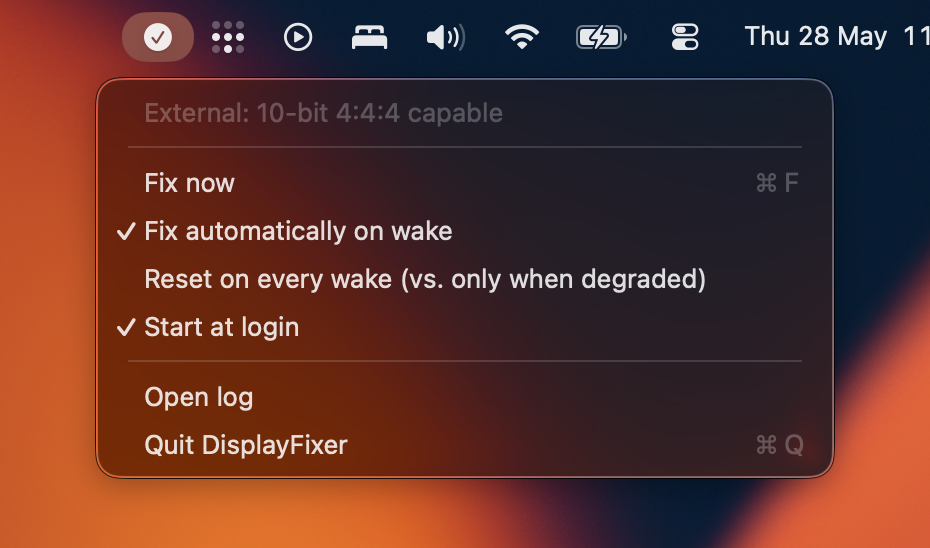

# DisplayFixer

A small macOS menu-bar app that keeps an external display at 10-bit 4:4:4 when it's driven
through a Synaptics VMM7100 USB-C to HDMI adapter. Without it, these adapters tend to come back
as washed-out 8-bit YCbCr 4:2:2 every time the Mac wakes from sleep.

I built it for my own setup: an M4 Pro on macOS 26.4.1 running a 4K 165 Hz display through a
Cable Matters VMM7100 adapter. That's the only place it's been tested, so your mileage may vary.



## The problem

The adapter shows up to macOS as a DisplayPort sink (DP 1.4 / HBR3) and converts to HDMI 2.1 on
the far side. At 4K 165 Hz, 10-bit 4:4:4 only fits down the DisplayPort link with DSC (Display
Stream Compression) turned on. After a wake, macOS often fails to bring DSC back up, so it falls
back to the densest format that fits without it: 8-bit YCbCr 4:2:2. It also stops offering 10-bit
4:4:4 at all until the link is renegotiated. The manual fix most people land on is to unplug and
replug the cable (or toggle HDR), then reselect 10-bit. DisplayFixer does that part for you.

## What it does

On every wake, and when a display reconnects, it:

1. Resets the VMM7100 over USB, which renegotiates the link into a DSC-capable state. This is the
   same "reset board" command that Synaptics' own Windows tool (VMMHIDTool) sends.
2. Toggles HDR on and back off, which leaves the wire at 10-bit 4:4:4 in SDR.

## How it works

A few details that weren't obvious and are worth writing down:

- The reset is three USB HID `SET_REPORT` control transfers to the Synaptics chip (`06CB:7100`).
  On macOS 26 you can't open the USB *interface* anymore (it returns `kIOReturnExclusiveAccess`),
  which is _probably_ what broke BetterDisplay's version of this reset. DisplayFixer sends the packets
  through a device-level `DeviceRequest` instead, and that still works.
- It decides whether a fix is needed by checking `SLSDisplaySupportsHDRMode`, which reads 0 while
  the DSC link is down. That turns out to be a reliable enough "we're in the bad state" signal.
- The 10-bit 4:4:4 comes from the HDR toggle (`SLSDisplaySetHDRModeEnabled`). Turning HDR on
  forces 10-bit, and therefore DSC; turning it back off leaves you at 10-bit 4:4:4 without HDR.

## Requirements

- An Apple Silicon Mac (it uses the DCP display path).
- macOS 13 or later. Developed on macOS 26.4.1.
- A VMM7100-based USB-C to HDMI adapter (Cable Matters and several others use this chip). With a
  different chip the app simply finds nothing to reset and does nothing.

## Build and install

```sh
./build.sh                          # builds DisplayFixer.app (ad-hoc signed)
mkdir -p ~/Applications
cp -R DisplayFixer.app ~/Applications/
open ~/Applications/DisplayFixer.app
```

Then open the menu-bar item and turn on "Start at login" so it survives reboots.

## Usage

The menu-bar glyph shows the state: ✓ healthy, ▲ degraded, ⊝ no external display.

- Fix now: run the whole sequence by hand. The screen blanks for a second while the adapter resets.
- Fix automatically on wake: on by default.
- Reset on every wake: off by default, so it only resets when it detects the bad state. Turn it on
  if you'd rather reset every wake regardless; the brief screen blank is the tradeoff.
- Start at login, Open log, Quit.

Logs go to `~/Library/Logs/DisplayFixer/displayfixer.log`.

## Caveats

- It uses private macOS frameworks (SkyLight and the IOKit USB internals). Apple can change those
  in any release, and it's the reason the app can't be sandboxed or shipped on the App Store.
- It only handles the first external display, which is fine for a single-monitor setup.
- The reset packets were captured from one adapter's firmware, so they might not match every
  VMM7100 revision. If they don't, the reset does nothing rather than breaking anything.
- Build it yourself from source with `build.sh`. A prebuilt unsigned binary gets blocked by Gatekeeper.

## How it was found

The `research/` folder has the throwaway probes I used to work the mechanism out: reading the wire
color format off the DCP, poking at the IOAVService link controls, the HDR toggle, and the USB
reset. They're kept around in case anyone wants to see how the pieces fit together.

## Credits

- [djrobx/USBResetter](https://github.com/djrobx/USBResetter) reverse-engineered the VMM7100 reset
  command from Synaptics' Windows VMMHIDTool.
- [waydabber/vmm7100reset](https://github.com/waydabber/vmm7100reset) (MIT) is the Swift port that
  shipped in BetterDisplay; the reset byte sequence used here comes from it.
- The Apple Silicon DDC/DCP groundwork comes from [m1ddc](https://github.com/waydabber/m1ddc) and
  [MonitorControl](https://github.com/MonitorControl/MonitorControl).

See [CREDITS.md](CREDITS.md).

## License

MIT. See [LICENSE](LICENSE).
